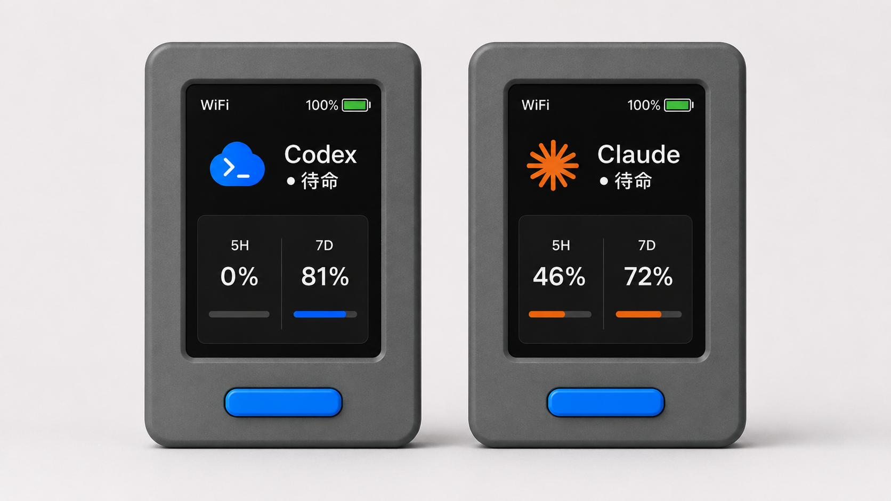
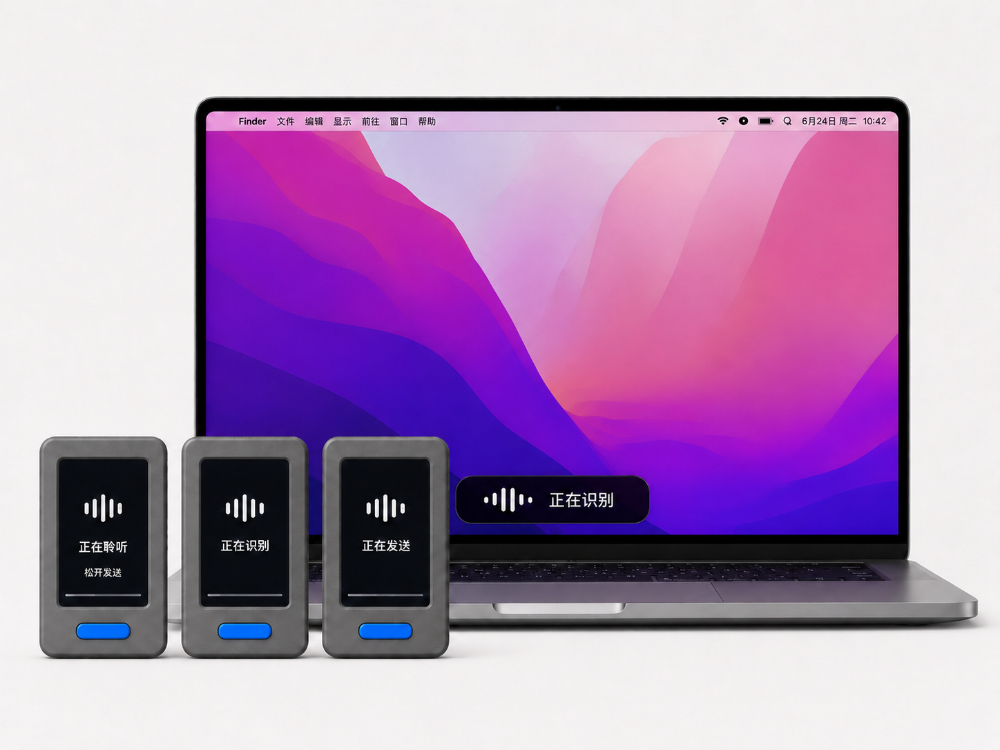

# VibeStick

[English README](README.md)





VibeStick 把 M5Stack StickS3 变成一个桌面 AI agent 小终端：显示状态、5H/7D 用量、提醒音，并支持长按说话后自动转写粘贴到 Mac。

VibeStick 面向 M5Stack StickS3，不是 M5Stack 官方项目。Codex、Claude 等第三方 agent 名称只用于说明本地兼容工具和集成。

## 开始前的准备

- [ ] M5 StickS3｜一根 USB-C 数据线｜一台电脑（最好是Mac）
- [ ] Wi-Fi（必须是 2.4GHz） 名称｜Wi-Fi密码｜语音识别模型 API Key
- [ ] 提供 `swiftc` 的 Xcode Command Line Tools。图形安装器会在缺少时打开 Apple 安装提示，并自动下载隔离的 Python 3.12 运行组件；手动安装仍需 Python 3.11 或更高版本
-  语音转写 API key 推荐从 SiliconFlow 官方入口获取：<https://cloud.siliconflow.cn>。国内直连、有免费额度、OpenAI 兼容；演示视频用的就是 SiliconFlow。可改用其他 OpenAI 兼容服务的 `base_url` 和模型名称。
-  如要显示 Claude 5H/7D 用量（该功能默认关闭）。需要 Claude Code CLI（在终端运行 `claude` 后执行 `/login`），并在 `.env` 中设置 `VIBE_STICK_CLAUDE_USAGE=on`。


## 安装

你可以手动执行，也可以交给 AI 编程 agent，例如 Claude Code 和 Codex。

### 图形安装器（开发预览版）

macOS 14 或更高版本可以直接使用原生安装器。主界面只有三步：填写 Wi‑Fi 和可选的语音输入、连接 StickS3、自动安装并检查结果；高级参数和技术日志仅在需要时展开：

```sh
git clone https://github.com/GaryGaryyy/VibeStick.git
cd VibeStick
./script/build_and_run.sh
```

构建出的 `.app` 已包含一份不带密码的最小项目模板，首次启动会自动放到 `~/Library/Application Support/VibeStick/InstallerProject`，因此应用可以离开源码目录独立运行，也不需要“文稿”目录权限。首次使用仍会下载约 1 GB 的 ESP-IDF；它还不是面向公众分发的公证 DMG。当前安全与打包边界见 [`app/macos/README.md`](app/macos/README.md)。

### 手动安装

> 说明：标 👤 的步骤是需要人亲自动手的物理操作，例如插线、长按/短按电源键、在系统设置里授权。AI agent 请按顺序执行 shell 步骤，执行到 👤 步骤时暂停，让用户完成后再继续。

1. 克隆仓库并创建本地配置文件：

```sh
git clone https://github.com/GaryGaryyy/VibeStick.git
cd VibeStick
./scripts/setup.sh
```

2. 填入人类提前准备好的配置：

```sh
open -e firmware/sticks3/include/vibe_stick_secrets.h
open -e .env
```

在 `vibe_stick_secrets.h` 里填写 Wi-Fi 名称、Wi-Fi 密码、Mac bridge host。只要文件里还保留示例占位值，`scripts/setup.sh` 会尝试把 `VIBE_STICK_BRIDGE_HOST` 自动写成检测到的 en0 局域网 IP。

在 `.env` 里填写 ASR key 和需要的 provider 设置。默认推荐 SiliconFlow：

```sh
VIBE_STICK_ASR_PROVIDER=openai-compatible
VIBE_STICK_ASR_BASE_URL=https://api.siliconflow.cn/v1
VIBE_STICK_ASR_API_KEY=your-siliconflow-key
VIBE_STICK_ASR_MODEL=FunAudioLLM/SenseVoiceSmall
```

VibeStick 只把 `.env` 当配置数据解析，不会把它作为 shell 脚本执行。只使用 `VIBE_STICK_*` 或 `CLAUDE_CODE_OAUTH_TOKEN` 键；包含空格的值必须加引号。不要执行 `source .env`。

安装前检查本机运行环境：

```sh
python3 --version
xcrun --find swiftc
```

如果 `python3` 低于 3.11，请从 [python.org](https://www.python.org/downloads/macos/) 或 Homebrew 安装新版 Python，并把绝对路径写入 `.env`；例如 Apple Silicon 可使用 `VIBE_STICK_PYTHON=/opt/homebrew/bin/python3.12`。不要用 `sudo` 运行安装器。

3. 👤 用 USB-C 数据线把 StickS3 插到 Mac。

4. 👤 让 StickS3 进入下载模式：长按侧面电源键，直到指示灯闪烁两次、屏幕熄灭。这是 ESP32-S3 烧录必需步骤。

5. 如果本机还没有 ESP-IDF，先安装；然后把它加载到当前 shell。这是一次性工具链安装，下载较大（约 1GB），可能需要几分钟。每开一个新终端，在运行 `idf.py` 前都要先执行加载命令：

```sh
if [ ! -d "$HOME/esp/esp-idf" ]; then
  mkdir -p ~/esp && cd ~/esp
  git clone -b v5.5.1 --recursive https://github.com/espressif/esp-idf.git
  cd esp-idf && ./install.sh esp32s3
fi
. "$HOME/esp/esp-idf/export.sh"
```

也可以按 Espressif [官方指南](https://docs.espressif.com/projects/esp-idf/en/v5.5.1/esp32s3/get-started/index.html)安装。如果 `install.sh` 失败，请确认已安装 `git`、`python3`、`cmake`，或改按官方指南处理。如果 ESP-IDF 安装在其他位置，请调整路径。

6. 构建并烧录固件：

```sh
cd firmware/sticks3
idf.py -p <port> build flash
cd ../..
```

如果不知道端口，运行：

```sh
ls /dev/cu.*
```

等到终端出现 `Hash of data verified`。

7. 👤 短按电源键唤醒屏幕。指示灯应熄灭、屏幕亮起，此时应看到 VibeStick 首页。联网前可能显示离线。

8. 安装本机 macOS bridge 和 HUD：

```sh
./scripts/install.sh
```

安装器会先在 staging 目录完成构建和预检查，切换 LaunchAgent 后验证 `/health`；如果新版本启动失败，会自动恢复上一个已安装版本。

StickS3 当前使用明文 HTTP。共享 token 只能给受保护的请求做授权，网络上传输并未加密，也无法防止被动监听和重放。请只在私有、可信的局域网使用，不要把 `8765` 端口暴露到互联网，并使用 macOS 防火墙限制访问。

9. 👤 当 macOS 提示所配置的 Python 可执行文件或 `osascript` 想使用辅助功能时，点击“打开系统设置”并允许。粘贴转写结果需要这个权限。

10. 检查安装状态：

```sh
./scripts/doctor.sh
```

尽量让必须项全部 PASS。然后看一眼 StickS3：如果本机 provider 数据可用，Codex / Claude 状态和 5H / 7D 应该出现真实值。

如果 Codex 已经能用、而 Claude 那栏显示 `--%`，这是正常的：Claude 用量默认关闭（更安全）；如需显示，请设置 `VIBE_STICK_CLAUDE_USAGE=on`，并确保 Claude Code 已通过 `claude` 和 `/login` 登录。

11. 👤 打开任意文本框，长按正面蓝键说话，松开后 VibeStick 应自动转写并粘贴。单击蓝键发送当前草稿，双击蓝键暂停当前 Codex 任务。

开发调试时可以用 `./scripts/dev.sh` 替代 `./scripts/install.sh`，它会在当前终端里运行 bridge。

### 卸载

```sh
./scripts/uninstall.sh
```

默认卸载会停止并删除两个 LaunchAgent，但保留 `~/Library/Application Support/VibeStick/`，其中包括已安装配置、运行时代码、日志、缓存状态、转写和录音。若也要删除这些已安装数据，运行 `./scripts/uninstall.sh --purge`。两种模式都不会删除仓库里的 `.env` 和 `firmware/sticks3/include/vibe_stick_secrets.h`。

## 常见问题排查

### `command not found: idf.py`

ESP-IDF 没有加载到当前 shell，或者还没有安装。先 source ESP-IDF 的 `export.sh`，再运行 `idf.py`：

```sh
. $HOME/esp/esp-idf/export.sh
```

如果你的 ESP-IDF 在其他位置，请调整路径。每开一个新终端，在使用 `idf.py` 前都要运行一次。

### 烧录报 "Device not configured" 或连不上串口

重新插拔 USB-C 数据线。再次进入下载模式：长按侧面电源键，直到指示灯闪烁两次、屏幕熄灭。运行 `ls /dev/cu.*` 找端口，然后重试 `idf.py -p <port> build flash`。

### StickS3 连不上 Wi-Fi

请使用 2.4GHz Wi-Fi。StickS3 / ESP32-S3 不支持 5GHz Wi-Fi。

### 录音能转写但没有粘贴

给执行粘贴的 Python runner 开辅助功能权限。macOS 路径：系统设置 -> 隐私与安全性 -> 辅助功能，然后允许所配置的 Python 可执行文件或运行 VibeStick 的终端 / 启动器。

### "No transcription adapter configured"

在 `.env` 里配置 ASR，尤其是 `VIBE_STICK_ASR_PROVIDER`、`VIBE_STICK_ASR_BASE_URL`、`VIBE_STICK_ASR_API_KEY`，然后重新安装：

```sh
./scripts/install.sh
```

### 找不到 `.env`

`.env` 是隐藏文件。用下面命令打开：

```sh
open -e .env
```

### 录音转写失败、SSL 报错或超时

通常是当前网络访问不到所选 ASR 服务。国内用户可从 SiliconFlow 官方入口配置：<https://cloud.siliconflow.cn>。也可以配置其他可访问的 OpenAI 兼容 ASR，或配置网络代理。

## 配置说明

不要把真实 API key、本地 token、Wi-Fi 密码、本地日志、录音文件提交到 git。

`.env` 里的空值通常表示“使用内置默认值”。脚本会在不执行 shell 的情况下解析 `.env`；只支持 `VIBE_STICK_*` 和 `CLAUDE_CODE_OAUTH_TOKEN`，包含空格的值要加引号，不要写内联 shell 命令，也不要 `source .env`。`scripts/dev.sh` 读取仓库根目录副本；`scripts/install.sh` 会把它复制到 `~/Library/Application Support/VibeStick/.env`，LaunchAgent 读取安装后的副本。

### 核心设置

- `VIBE_STICK_PROJECT_ROOT`：Bridge 状态的项目路径/显示名称兜底；Codex 提醒仍会观察这台 Mac 上所有由用户启动的根对话。
- `VIBE_STICK_PROJECT_NAME`：可选显示名称。
- Codex 观察覆盖这台 Mac 上每个用户启动的根对话，后台 subagent 不会触发提醒。
- `VIBE_STICK_PROVIDER`：当前 provider，`auto`、`codex` 或 `claude`；默认 `auto`。
- `VIBE_STICK_BRIDGE_TOKEN`：bridge 绑定到非 loopback 地址时必需的共享 token，例如 `0.0.0.0`。
- `VIBE_STICK_MAX_RECORDING_AUDIO_BYTES`：`/recording/audio` 最大请求体大小，默认 `2000000`。
- `VIBE_STICK_RECORDING_USE_MAC_MIC`：设为 `0` 可关闭 Mac 麦克风兜底。
- `VIBE_STICK_RECORDING_START_CMD` / `VIBE_STICK_RECORDING_STOP_CMD`：高级外部录音 hook；两者从 stdin 接收 session JSON，成功的 stop hook 需要把转写文本写到 stdout。
- `VIBE_STICK_AUTO_ENTER`：设为 `1` 会在粘贴后自动按 Return；默认 `0` 会保留草稿，随后可单击蓝键发送。
- `VIBE_STICK_RECORDING_START_TIMEOUT_SECONDS`：start hook 的时间预算，默认且最大为 `2` 秒，确保不超过固件 2.5 秒的请求超时。
- `VIBE_STICK_RECORDING_STOP_TIMEOUT_SECONDS`：同步 stop hook 的时间预算，默认 `15` 秒，硬上限为 `18` 秒。
- `VIBE_STICK_RECORDING_RETENTION_DAYS`：录音媒体保留天数，默认 `7`；设为 `0` 会在下次清理时删除媒体文件。
- `VIBE_STICK_RECORDING_LEASE_SECONDS`：回收异常中断的 StickS3 录音会话，默认 `90` 秒（范围 `60`–`600`）。
- `VIBE_STICK_STORE_TRANSCRIPTS`：只有设为 `1` 才把转写文本持久化到 `recording.json`；默认 `0` 不保存。

### ASR 方案 1：SiliconFlow（默认推荐）

```sh
VIBE_STICK_ASR_PROVIDER=openai-compatible
VIBE_STICK_ASR_BASE_URL=https://api.siliconflow.cn/v1
VIBE_STICK_ASR_API_KEY=your-siliconflow-key
VIBE_STICK_ASR_MODEL=FunAudioLLM/SenseVoiceSmall
VIBE_STICK_ASR_LANGUAGE=zh
VIBE_STICK_ASR_TIMEOUT_SECONDS=10
VIBE_STICK_ASR_ATTEMPTS=2
```

两次尝试时，每次请求约有 8.8 秒，使云端 ASR 保持在 18 秒硬时限内，并为设备 30 秒超时前的粘贴操作留出余量。

使用云端 ASR 时，音频会离开本机 Mac。

### ASR 方案 2：任意 OpenAI 兼容服务

只要服务支持 `POST {base_url}/audio/transcriptions` 即可。

```sh
VIBE_STICK_ASR_PROVIDER=openai-compatible
VIBE_STICK_ASR_BASE_URL=https://example.com/v1
VIBE_STICK_ASR_API_KEY=your-api-key
VIBE_STICK_ASR_MODEL=provider-model-name
```

### ASR 方案 3：本地命令（离线）

```sh
VIBE_STICK_TRANSCRIBE_CMD=/path/to/transcribe-command
VIBE_STICK_TRANSCRIBE_TIMEOUT_SECONDS=15
```

这个命令会从 stdin 收到录音 session JSON，并应把最终转写文本打印到 stdout。配置的转写命令和录音 hook 会通过 `/bin/sh` 执行，因此应视为可信本地代码；输入输出均有限额，超时会清理整个命令进程组。其超时同样受同步停止预算限制。

### Claude 用量

想显示 Claude 5H/7D 用量，请使用 `VIBE_STICK_PROVIDER=claude` 或 `VIBE_STICK_PROVIDER=auto`，设置 `VIBE_STICK_CLAUDE_USAGE=on`，并确保 Claude Code CLI 已在终端通过 `claude` 和 `/login` 登录。

- `VIBE_STICK_CLAUDE_USAGE`：设为 `on` 后获取真实 Claude Code 订阅用量；默认 `off`。
- `CLAUDE_CODE_OAUTH_TOKEN`：可选 Claude Code OAuth access token。未设置时，bridge 会尝试读取本机 Claude Code keychain / 文件凭据。
- `VIBE_STICK_CLAUDE_USAGE_INTERVAL_SECONDS`：Claude 用量轮询间隔，默认 `300`，最小 `30`。

Claude usage 会使用用户本机 Claude Code 订阅凭据和 client headers 调用未公开的 Anthropic endpoint。它是 opt-in，可能随时失效；bridge HTTP API 不会暴露 token 或原始 endpoint 响应。如果从未成功抓取过 Claude usage，StickS3 会显示 `--%`；成功抓取后，临时刷新失败会保留上一次值并标记 stale。

由于 Bridge 走明文 HTTP，请把 `VIBE_STICK_BRIDGE_TOKEN` 视为“可信局域网内的访问控制”，而不是防网络监听的加密措施。设备遗失或曾接入不可信网络时，应同时轮换两份本地配置里的 token、重新烧录固件，并视情况更换 Wi-Fi 密码。

## 项目结构

```text
VibeStick/
  README.md
  README.zh-CN.md
  .env.example
  docs/
  firmware/sticks3/
  bridge/src/vibe_stick/
  app/macos/Sources/VibeStickSetup/
  app/macos/VibeStickHUD/
  script/build_and_run.sh
  scripts/
  tests/
```

## 检查命令

```sh
python3 -m compileall -q bridge/src tests
PYTHONPATH=bridge/src python3 -m unittest discover -s tests
swift test --package-path app/macos
sh -n scripts/*.sh
bash -n scripts/*.sh
```

固件构建仍需要 ESP-IDF：

```sh
cd firmware/sticks3
. $HOME/esp/esp-idf/export.sh
idf.py build
```

v0.1.5 的完整审查、验证记录和剩余风险见
[`docs/CODE_AUDIT_2026-07-17.md`](docs/CODE_AUDIT_2026-07-17.md)。

## 当前限制

- 原生安装器目前是由 SwiftPM 在本机生成的开发预览版，还不是经过公证、可公开分发的 DMG。
- 固件只面向 M5Stack StickS3。
- Codex quota 来自本地 Codex session JSONL 里的 `rate_limits`，不是官方 quota API。
- Claude usage 来自未公开的 Claude Code OAuth endpoint，默认关闭。
- ASR 可靠性取决于麦克风采集、上传 PCM 质量、provider 可达性和模型配置。

## 贡献与安全

欢迎贡献,详见 [CONTRIBUTING.md](CONTRIBUTING.md)。报告安全漏洞请见
[SECURITY.md](SECURITY.md)(请私下报告)。

## 许可证

VibeStick 使用 MIT License 发布。见 [LICENSE](LICENSE)。
